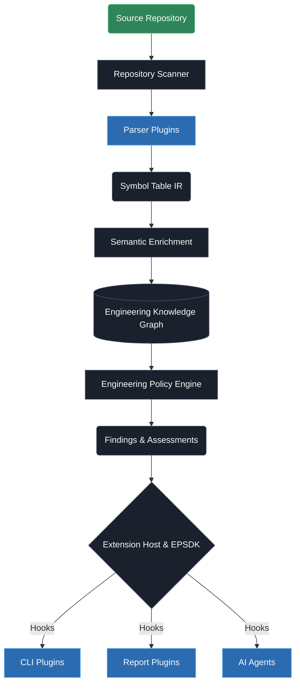

<div align="center">

# Open Source Engineering Framework (OSEF)

**The Engineering Operating System for AI-Assisted Software Development**

OSEF transforms unstructured source code into an immutable Engineering Knowledge Graph, allowing you to enforce architectural policies, audit dependencies, and build custom intelligence extensions natively in Python.

[](#)
[](#)
[](#)
[](#)

</div>

<br />

## 📖 What is OSEF?

Modern software engineering struggles with architectural drift, hidden dependencies, and tribal knowledge. OSEF solves this by providing a universal, programmatic interface to your codebase. 

Instead of relying on regex or fragile AST traversal scripts, OSEF parses your repository into a queryable **Engineering Knowledge Graph (EKG)**. Developers and AI agents can query this graph to instantly understand how components communicate, where policies are violated, and how the architecture has evolved.

---

## ⚡ Why OSEF?

| Feature | Description |
| :--- | :--- |
| **🧠 Engineering Knowledge Graph** | An immutable, language-agnostic representation of your software's architecture. |
| **⚖️ Engineering Policy Engine** | Execute deterministic architectural rules via a lightning-fast graph query cache. |
| **🔌 Extensible SDK** | Write custom parsers, rules, and CLI commands via the sandboxed Extension Host. |
| **🤖 AI-Ready Abstractions** | Provide LLMs and Agents with a structured API to reason about codebase architecture. |
| **🏢 Enterprise-Grade Design** | Built on immutable contracts, versioned capabilities, and strict decoupling. |

---

## 🏗️ Architecture Overview

OSEF Core is intentionally small. It defines abstractions, while community plugins implement language support and rules.



> **Read the specs**: Discover the internal design in our [Architecture Index](ARCHITECTURE_INDEX.md).

---

## ⚙️ Engineering Pipeline

1. **Repository Scanner**: Discovers the project root and metadata.
2. **Parser**: Translates source code into the canonical Symbol Table (Intermediate Representation).
3. **Semantic Enrichment Layer**: Applies heuristics to classify symbols (e.g., Services, DTOs).
4. **Engineering Knowledge Graph (EKG)**: The immutable, queryable source of truth.
5. **Engineering Policy Engine (EPE)**: Resolves rule dependencies via DAG and executes deterministic engineering policies.
6. **Engineering Assessments**: Structures EPE Findings into domain-specific facts.
7. **Extension Host & EPSDK**: The runtime that loads plugins, sandboxes execution, and exposes the SDK.

---

## 📊 Current Capabilities

- ✅ **Python Standard Library Parsing** (via `ast`)
- ✅ **Symbol Table Generation & Semantic Enrichment**
- ✅ **Engineering Knowledge Graph API**
- ✅ **Engineering Policy Engine (EPE)**
- ✅ **Engineering Platform SDK (EPSDK)**
- ✅ **Capability-Driven Runtime**
- ✅ **Documentation Intelligence Plugin**
- 🚧 **TypeScript & Go Parsers** *(In Progress)*

---

## 🔌 Plugin Ecosystem

**Current Official Plugins**
- ✅ **Python Reference Platform**: Parser capability anchor.
- ✅ **Documentation Intelligence Plugin**: Reference Plugin #1 (Certified).

**Future Official Plugins**
- 🚧 Graph Visualization
- 🚧 Infrastructure Intelligence
- 🚧 Docker Intelligence
- 🚧 GitHub Actions Intelligence
- 🚧 Enterprise Policy Pack
- 🚧 FastAPI Intelligence
- 🚧 Language Packs (Java, Go, Rust, TypeScript, C#, Kotlin)

---

## 🚀 Quick Start

### Installation

```bash
# Clone the repository
git clone https://github.com/Aryamannatrajan21/OSEF.git
cd OSEF

# Setup a virtual environment
python3 -m venv .venv
source .venv/bin/activate

# Install OSEF
pip install -e .
```

### Basic Usage

```bash
# Verify installation
osef --version

# Analyze the current repository
osef analyze .

# Generate an architectural report
osef report --format markdown
```

---

## 💻 CLI Overview

| Command | Description |
| :--- | :--- |
| `osef analyze <path>` | Scans the repository and executes enabled Policy Packs. |
| `osef report` | Outputs findings into Markdown, JSON, or HTML. |
| `osef doctor` | Validates environment and installed plugins. |
| `osef plugins` | *(Plugin-injected)* Lists active extensions and capabilities. |

> See the full [CLI Extension Specification](docs/architecture/CLI_EXTENSION_SPEC.md) for how to build custom commands.

---

## 📁 Repository Structure

```text
OSEF/
├── docs/                 # Frozen architectural contracts and guides
├── src/osef/
│   ├── analyzers/        # Assessment mapping orchestrators
│   ├── cli/              # Core Typer CLI
│   ├── core/             # EKG, Parsing, and Semantics
│   ├── epe/              # Engineering Policy Engine
│   ├── sdk/              # Extension Host and Public Interfaces
│   └── intelligence/     # Core domain models
├── tests/                # Test suites
└── pyproject.toml
```

---

## 📚 Documentation

OSEF's documentation is treated as a first-class product feature. We operate on a strict *Documentation Freeze* model where architecture contracts are immutable.

- 🧭 **[Specifications Index](SPECIFICATIONS.md)**: The master index of all frozen architectural contracts.
- 🏗️ **[Architecture Index](ARCHITECTURE_INDEX.md)**: A guided tour of OSEF's internal design.
- 🛠️ **[Extension Developer Guide](docs/architecture/EXTENSION_DEVELOPER_GUIDE.md)**: How to build an OSEF Plugin.
- 🗺️ **[Roadmap](ROADMAP.md)**: Our strategic vision.
- 📝 **[Changelog](CHANGELOG.md)**: Historical architectural milestones.

---

## 🗺️ Roadmap Snapshot

**Phase I — Platform Engineering (Completed)**
- Foundation & Governance
- Repository Intelligence (EKG)
- Engineering Policy Engine (EPE)
- Engineering Platform SDK (EPSDK)
- Capability-Driven Runtime
- Platform Validation (Documentation Intelligence Plugin)

**Phase II — Ecosystem Engineering (Active)**
- Reference Plugins
- Language Packs
- Enterprise Packs
- Marketplace
- AI Engineering Intelligence

> Read the full [Roadmap](ROADMAP.md).

---

## 🤝 Contributing

We welcome contributions from the community! Whether you want to build a custom language parser, a new architectural rule pack, or improve the core platform, we are excited to have you.

Please read our [Contributing Guidelines](CONTRIBUTING.md) to get started.

---

## 💬 Community

- **Discussions**: [GitHub Discussions](#)
- **Issues**: [GitHub Issues](https://github.com/Aryamannatrajan21/OSEF/issues)
- **Wiki**: [GitHub Wiki](#)

---

## 📄 License

This project is licensed under the Apache License 2.0 - see the [LICENSE](LICENSE) file for details.
