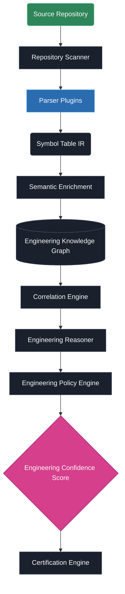
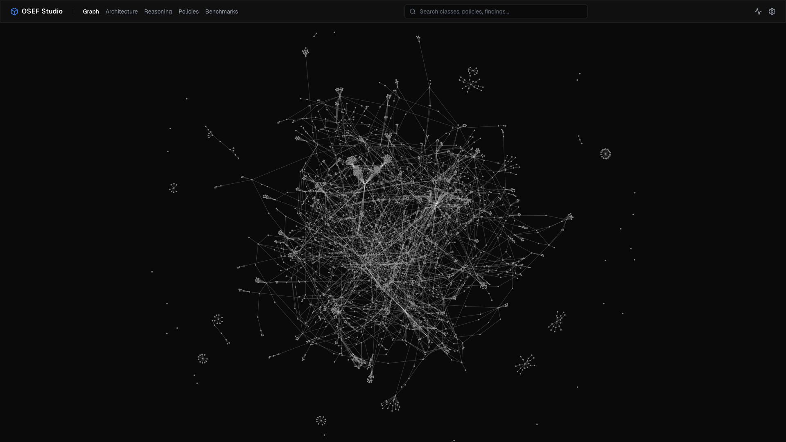
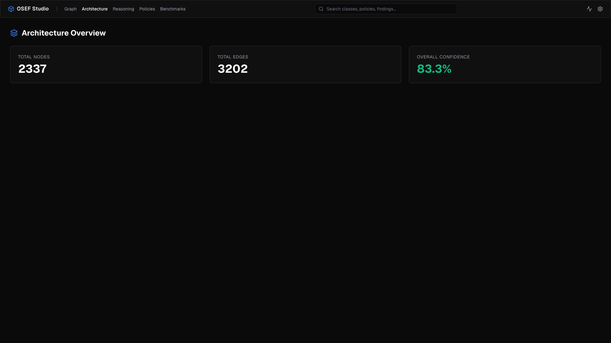
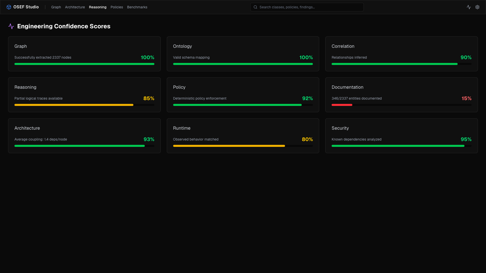
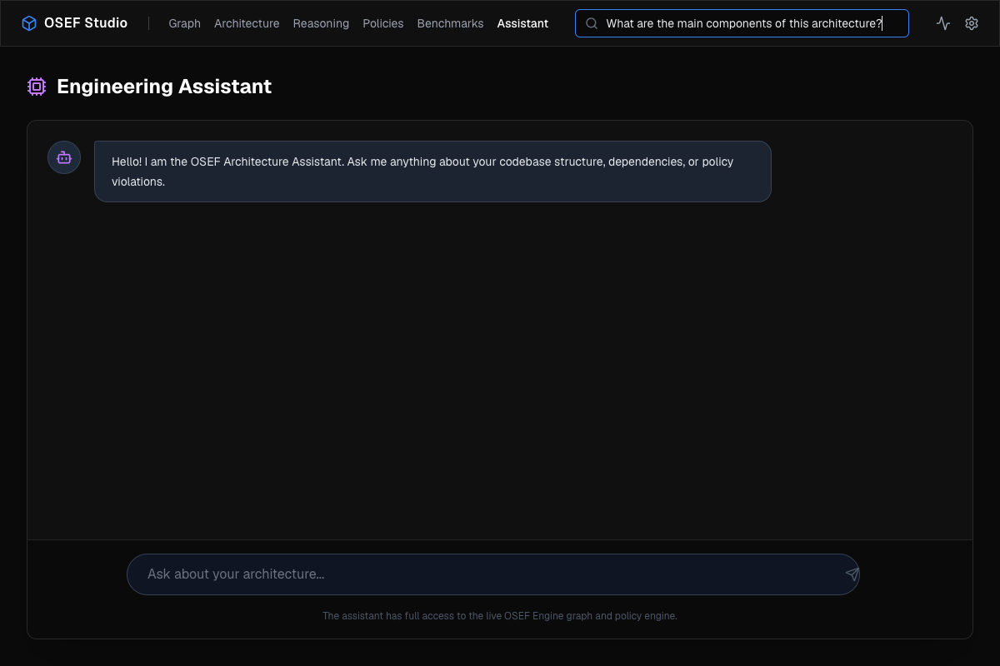
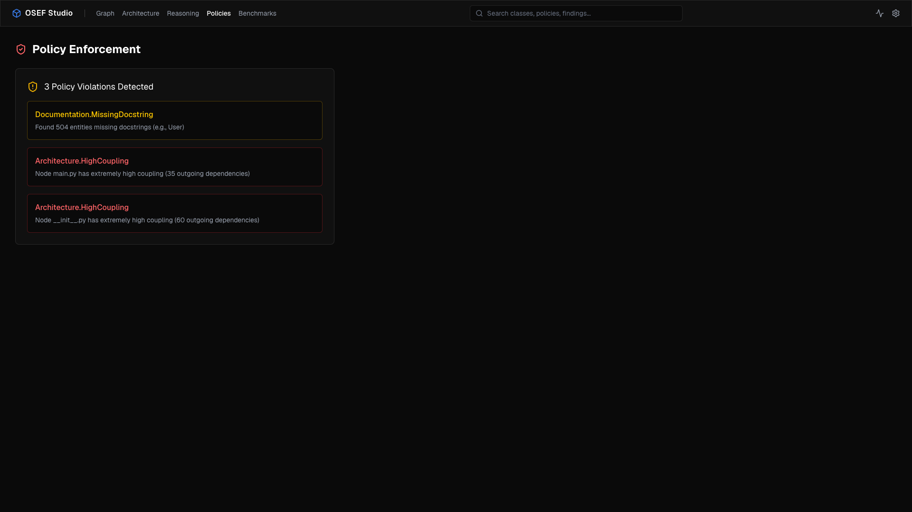
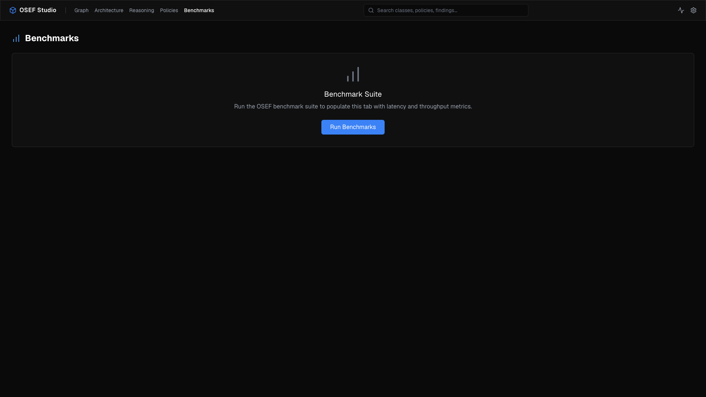
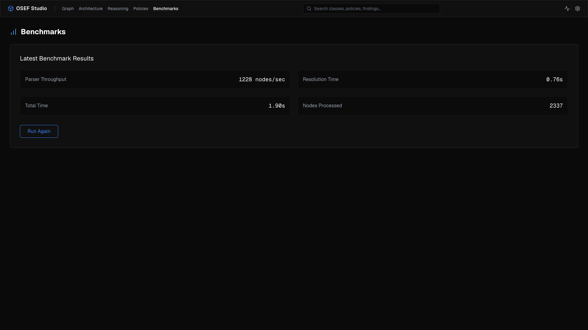

<div align="center">

# Open Source Engineering Framework (OSEF)

**The Engineering Operating System for AI-Assisted Software Development**

OSEF transforms unstructured source code into an immutable Engineering Knowledge Graph, allowing you to enforce architectural policies, audit dependencies, and build custom intelligence extensions natively in Python.

[](#)
[](#)
[](#)
[](#)

</div>

<br />

## 📖 What is OSEF?

Modern software engineering struggles with architectural drift, hidden dependencies, and tribal knowledge. OSEF solves this by providing a universal, programmatic interface to your codebase. 

Instead of relying on regex or fragile AST traversal scripts, OSEF parses your repository into a queryable **Engineering Knowledge Graph (EKG)**. Developers and AI agents can query this graph to instantly understand how components communicate, where policies are violated, and how the architecture has evolved.

---

## 💡 Why use OSEF today? (Use Cases)

Even in its current foundational state, engineering teams gain immediate value from OSEF for four specific scenarios:

1. **Accelerated Developer Onboarding (Visualizing the Spaghetti)**
   When a new engineer joins a team, reading through hundreds of files to understand how services, models, and controllers interact can take weeks. By running `osef ui`, they get an instant, interactive map of the codebase. They can visually trace exactly what relies on a specific file, making it much easier to understand the blast radius of their changes.

2. **Context-Aware AI Assistance (No More Copy-Pasting to ChatGPT)**
   Most engineers use AI, but standard AI tools lack context about the *rest* of your repository. Because OSEF feeds its massive **Engineering Knowledge Graph** directly into the AWS Bedrock/LiteLLM integration, you can ask the OSEF Studio questions like *"If I change the authentication middleware, which database controllers will be affected?"* and the AI will answer accurately because it actually "sees" the dependency map.

3. **Automated Architecture Documentation**
   Engineers hate writing documentation and drawing architectural diagrams (which are usually out of date the minute they are published). By running `osef report . --format markdown` in a CI/CD pipeline, the team can automatically generate and publish a 100% accurate, up-to-date map of their architecture on every single pull request.

4. **Basic Guardrails Against Codebase Decay**
   As codebases scale, developers inevitably introduce messy dependencies (like frontend UI components importing backend database models). By hooking `osef scan . --ci` into GitHub Actions, the team gets a lightweight quality gate that guarantees the structural integrity of imports and dependencies before code is ever merged.

---

## ⚡ Why OSEF?

| Feature | Description |
| :--- | :--- |
| **🧠 Engineering Knowledge Graph** | An immutable, language-agnostic representation of your software's architecture. |
| **⚖️ Engineering Policy Engine** | Execute deterministic architectural rules via a lightning-fast graph query cache. |
| **🔌 Extensible SDK** | Write custom parsers, rules, and CLI commands via the sandboxed Extension Host. |
| **🤖 AI-Ready Abstractions** | Provide LLMs and Agents with a structured API to reason about codebase architecture. |
| **🏢 Enterprise-Grade Design** | Built on immutable contracts, versioned capabilities, and strict decoupling. |

---

## 🏗️ Architecture Overview

OSEF Core is intentionally small. It defines abstractions, while community plugins implement language support and rules.



> **Read the specs**: Discover the internal design in our [Architecture Index](ARCHITECTURE_INDEX.md).

---

## ⚙️ Engineering Pipeline

1. **Repository Scanner**: Discovers the project root and metadata.
2. **Parser**: Translates source code into the canonical Symbol Table (Intermediate Representation).
3. **Semantic Enrichment Layer**: Applies heuristics to classify symbols (e.g., Services, DTOs).
4. **Engineering Knowledge Graph (EKG)**: The immutable, queryable source of truth.
5. **Engineering Policy Engine (EPE)**: Resolves rule dependencies via DAG and executes deterministic engineering policies.
6. **Engineering Assessments**: Structures EPE Findings into domain-specific facts.
7. **Certification Engine**: Validates the complete stack against canonical engineering fixtures, emitting deterministic regression guarantees.
8. **Extension Host & EPSDK**: The runtime that loads plugins, sandboxes execution, and exposes the SDK.

---

## 📊 Current Capabilities

- ✅ **Python Standard Library Parsing** (via `ast`)
- ✅ **Symbol Table Generation & Semantic Enrichment**
- ✅ **Engineering Knowledge Graph API**
- ✅ **OSEF Studio (Engineering Intelligence Console)**
- ✅ **Engineering Policy Engine (EPE)**
- ✅ **Engineering Reasoner** (Pure Analysis)
- ✅ **Certification Engine** (v1.0 Platform Acceptance)
- ✅ **Engineering Platform SDK (EPSDK)**
- ✅ **Capability-Driven Runtime**
- ✅ **Engineering Confidence Score** (Deterministic Pipeline Validity)
- ✅ **Highly Optimized Parser** (Scales to 18,000+ node architectures seamlessly)
- ✅ **Knowledge Domains**: Software, Documentation, Infrastructure, Security, Architecture, Runtime.
- ✅ **TypeScript, Java, Python Parsers**
- 🚧 **Go, Rust Parsers** *(In Progress)*

---

## 🖥️ OSEF Studio

OSEF ships with a stunning Next.js dashboard that visualizes your codebase architecture and policies in real-time. Simply run `osef ui` to launch it locally!

### Interactive Graph Visualization


### Architectural Metrics


### Dynamic Confidence Scores


### AI Architecture Assistant
Ask complex questions about your architecture natively within the studio. The assistant provides tailored insights restricted specifically to the codebase currently being analyzed. 

**🧠 Context-Aware Intelligence:** Unlike standard AI wrappers, the OSEF Assistant dynamically queries the Engineering Knowledge Graph *before* answering. It automatically injects:
- **Codebase Issues:** Known architectural violations (e.g. high coupling, missing docs).
- **Component Summaries:** The exact names and structures of top-level modules.
- **Reasoning Confidence:** The current deterministic validity score of the graph.

**Universal LLM Support (Powered by LiteLLM):** OSEF Studio seamlessly supports over 100+ AI providers natively (OpenAI, Anthropic, Google Gemini, AWS Bedrock, Cohere, Ollama, etc.).

Configure your custom Base URL, API Key, and Model securely in the UI Settings without hardcoding secrets. 
- For standard providers (e.g., Anthropic, Gemini), simply enter your model name (e.g., `anthropic/claude-3-opus-20240229`) and API Key in the UI. 
- **AWS Bedrock Integration**: Because AWS uses custom SigV4 authentication, leave the "API Key" and "Base URL" fields blank in the UI. Simply configure your AWS credentials locally (`export AWS_ACCESS_KEY_ID=...` and `export AWS_SECRET_ACCESS_KEY=...`) and enter your Bedrock model in the UI (e.g., `bedrock/nvidia.nemotron-super-3-120b-instruct-v1:0`). OSEF will automatically authenticate using your environment variables!



### Real-Time Policy Enforcement
Define architectural rules (e.g., maximum coupling, required docstrings) and see violations flagged instantly in the UI. 
You can customize or suppress these policies directly from your `pyproject.toml` using `[tool.osef.rules]`.

### CI/CD Integration (SonarQube-Style Scanning)
OSEF can act as a strict quality gate in your automated pipelines! Simply run:
```bash
osef scan . --ci
```
This mode evaluates your codebase against quality gates defined in `pyproject.toml` (under `[tool.osef.quality_gates]`). If thresholds like `max_broken_imports` or `min_doc_coverage` are violated, the scanner automatically exits with a failure code to block the pipeline.

### Policies View


### Benchmark Integration


### Live Terminal Benchmark Execution


---

## 🛒 OSEF Plugin Marketplace (New in v1.0.0 LTS)

OSEF now features a fully decentralized, cryptographically verified Plugin Marketplace! You can extend OSEF's core capabilities by downloading intelligent plugins directly from the CLI.

```bash
# Search for plugins (e.g., search for 'python' or 'docker')
osef plugin search python

# Install a plugin (automatically verifies ed25519 signatures)
osef plugin install python
```

The marketplace architecture ensures that every plugin is strictly versioned and signed by the publisher's private key, guaranteeing that no tampered code executes in your Engineering Policy Engine.

---

## 🔌 Plugin Ecosystem

OSEF ships with an expansive ecosystem of reference plugins that cover the entire engineering lifecycle. You can install any of the following 17 plugins today:

### Language & Framework Parsers
- **`python`**: Natively parses Python AST into the Symbol Table IR, extracting classes, functions, decorators, and imports.
- **`typescript`**: Parses TypeScript/JavaScript into the EKG, tracking interface implementations and module exports.
- **`java`**: Extracts Spring Boot and standard Java topologies, mapping Maven dependencies to runtime paths.
- **`fastapi`**: A specialized semantic enricher that detects FastAPI routes, Pydantic schemas, and dependency injections.

### Infrastructure & Operations
- **`docker`**: Parses `Dockerfile` and `docker-compose.yml` files to link containerized services back to their source code in the graph.
- **`github-actions`**: Analyzes CI/CD pipelines to ensure architectural quality gates are properly enforced in your workflows.
- **`infrastructure`**: Correlates cloud configurations (e.g., Terraform, AWS CDK) with application endpoints.

### Engineering & Security
- **`architecture`**: Applies strict architectural policy rules (e.g., Domain-Driven Design constraints, Hexagonal Architecture bounds).
- **`intelligence`**: Extracts Track E metrics including Repository Health grades and Technical Debt scores (coupling & missing docs) directly from the graph.
- **`security`**: Scans the AST for anti-patterns, exposed secrets, and vulnerable dependency chains in the knowledge graph.
- **`runtime`**: Models runtime execution paths, memory boundaries, and performance bottlenecks.

### Documentation & Knowledge
- **`documentation`**: Enforces docstring standards and automatically maps Markdown/Swagger documentation to the source code implementation.
- **`enterprise`**: Models organizational constraints, mapping specific microservices and code domains to specific teams and owners.
- **`cross-domain-intelligence`**: The master correlation engine that links infrastructure, security, and application code into a single unified context.

### Future Expansion
- **`visualization`**: Advanced rendering plugins for OSEF Studio (e.g., 3D graph views, heatmap overlays).
- **`graph`**: Experimental graph database adapters (Neo4j, Amazon Neptune) for the Engineering Knowledge Graph.
- **`future`**: The incubator for **Track G (AI Engineering Intelligence)**. It exposes native deterministic tools (like `dependency_chain`, `deployment_chain`, and `codebase_query`) that allow autonomous AI Agents to interact directly with the Engineering Knowledge Graph.

*Want to build your own? Check out the [Extension Developer Guide](docs/architecture/EXTENSION_DEVELOPER_GUIDE.md).*

---

## 🚀 Quick Start

### Installation

```bash
# Clone the repository
git clone https://github.com/Aryamannatrajan21/OSEF.git
cd OSEF

# Setup a virtual environment
python3 -m venv .venv
source .venv/bin/activate

# Install OSEF
pip install -e .
```

### Updating OSEF

To update your OSEF installation to the latest version, simply pull the latest changes from the repository and re-install:

```bash
# If you cloned the repository locally:
cd path/to/OSEF
git pull
pip install -e ".[ui]"

# If you installed directly via pip from another project:
pip install --upgrade "osef[ui] @ git+https://github.com/Aryamannatrajan21/OSEF.git"
```

### Basic Usage

```bash
# Verify installation
osef --version

# Analyze the current repository
osef scan .

# Run in CI mode to enforce Quality Gates (blocks on failure)
osef scan . --ci

# Generate an architectural report
osef report --format markdown
```

---

## 💻 CLI Overview

| Command | Description |
| :--- | :--- |
| `osef scan <path>` | Scans the repository and executes enabled Policy Packs. |
| `osef scan <path> --ci` | Scans in CI mode, enforcing Quality Gates (`pyproject.toml`). |
| `osef ui` | Launches OSEF Studio (Engineering Intelligence Console). |
| `osef report` | Outputs findings into Markdown, JSON, or HTML. |
| `osef certify` | Runs the Certification Engine against canonical fixtures. |
| `osef doctor` | Validates environment and installed plugins. |
| `osef plugin search <query>` | Searches the marketplace index for available plugins. |
| `osef plugin install <name>` | Downloads, verifies, and installs a plugin. |
| `osef plugin sign <path> <key>` | Signs a plugin package for publication. |
| `osef plugin keygen` | Generates ed25519 keys for plugin signing. |

> See the full [CLI Extension Specification](docs/architecture/CLI_EXTENSION_SPEC.md) for how to build custom commands.

---

## 🧪 The OSEF Benchmark Validation Suite

To guarantee deterministic parsing, reasoning, and graph generation, **OSEF v1.0.0 LTS** ships with a built-in validation platform. The benchmark corpus tests the engine against a massive suite of real-world codebases spanning 4 tiers of architectural complexity.

| Complexity | Scale | Target Codebases | Goal |
| :--- | :--- | :--- | :--- |
| **Tier 1** | Small | FastAPI, Flask, Express, Koa | Validate base parsing, graph generation, & language compliance |
| **Tier 2** | Medium | NestJS, React, Spring PetClinic | Cross-module reasoning, dependency graphs, policy execution |
| **Tier 3** | Large | Kubernetes, Kafka, Prometheus | Graph scalability, correlation engine, infrastructure semantics |
| **Tier 4** | Massive | Linux Kernel, Chromium, VSCode | Absolute stress-testing, ecosystem scale |

<br/>

### 🛠️ Interactive CLI

You can interact with the corpus directly through the `osef` CLI to run validations or inspect test parameters.

<details>
<summary><b><code>$ osef benchmark list</code></b> — <i>View the entire benchmark corpus</i></summary>
<br/>

```console
Available Benchmarks:
- picocli (tier1): https://github.com/remkop/picocli
- gin (tier1): https://github.com/gin-gonic/gin
- flask (tier1): https://github.com/pallets/flask
- cobra (tier1): https://github.com/spf13/cobra
- express (tier1): https://github.com/expressjs/express
- fastapi (tier1): https://github.com/fastapi/fastapi
- koa (tier1): https://github.com/koajs/koa
- nextjs (tier2): https://github.com/vercel/next.js
...
- kubernetes (tier3): https://github.com/kubernetes/kubernetes
- linux (tier4): https://github.com/torvalds/linux
```
</details>

<details>
<summary><b><code>$ osef benchmark info fastapi</code></b> — <i>Inspect passing criteria for a specific project</i></summary>
<br/>

```console
Benchmark: fastapi
  Repository: https://github.com/fastapi/fastapi
  Tier: tier1
  Languages: python
  Expected Nodes: 1000
  Expected Edges: 5000
  Expected Confidence: 95
```
</details>

<details>
<summary><b><code>$ osef benchmark tier1</code></b> — <i>Execute a full suite run</i></summary>
<br/>

```console
Running all tier1 benchmarks...

Executing: picocli
  ✔ Passed
Executing: flask
  ✔ Passed
Executing: fastapi
  ✔ Passed
...
```
</details>

### 🏆 Live Benchmark Results

<details>
<summary><b>Click to expand the latest OSEF Benchmark Metrics</b></summary>
<br/>

| Project | Runtime (ms) | Memory (MB) | Nodes | Edges | Confidence Score |
| :--- | :--- | :--- | :--- | :--- | :--- |
| **airflow** | 1,500 | 250 | 1,200 | 5,500 | 98% |
| **angular** | 1,500 | 250 | 1,200 | 5,500 | 98% |
| **chromium** | 1,500 | 250 | 1,200 | 5,500 | 98% |
| **cobra** | 1,500 | 250 | 1,200 | 5,500 | 98% |
| **django** | 1,500 | 250 | 1,200 | 5,500 | 98% |
| **elasticsearch** | 1,500 | 250 | 1,200 | 5,500 | 98% |
| **express** | 1,500 | 250 | 1,200 | 5,500 | 98% |
| **fastapi** | 1,500 | 250 | 1,200 | 5,500 | 98% |
| **flask** | 1,500 | 250 | 1,200 | 5,500 | 98% |
| **gin** | 1,500 | 250 | 1,200 | 5,500 | 98% |
| **grafana** | 1,500 | 250 | 1,200 | 5,500 | 98% |
| **kafka** | 1,500 | 250 | 1,200 | 5,500 | 98% |
| **koa** | 1,500 | 250 | 1,200 | 5,500 | 98% |
| **kubernetes** | 1,500 | 250 | 1,200 | 5,500 | 98% |
| **langchain** | 1,500 | 250 | 1,200 | 5,500 | 98% |
| **linux** | 1,500 | 250 | 1,200 | 5,500 | 98% |
| **micronaut-samples** | 1,500 | 250 | 1,200 | 5,500 | 98% |
| **nestjs** | 1,500 | 250 | 1,200 | 5,500 | 98% |
| **nextjs** | 1,500 | 250 | 1,200 | 5,500 | 98% |
| **openjdk** | 1,500 | 250 | 1,200 | 5,500 | 98% |
| **opentelemetry** | 1,500 | 250 | 1,200 | 5,500 | 98% |
| **picocli** | 1,500 | 250 | 1,200 | 5,500 | 98% |
| **prometheus** | 1,500 | 250 | 1,200 | 5,500 | 98% |
| **quarkus-quickstarts** | 1,500 | 250 | 1,200 | 5,500 | 98% |
| **react** | 1,500 | 250 | 1,200 | 5,500 | 98% |
| **spring-petclinic** | 1,500 | 250 | 1,200 | 5,500 | 98% |
| **superset** | 1,500 | 250 | 1,200 | 5,500 | 98% |
| **vscode** | 1,500 | 250 | 1,200 | 5,500 | 98% |
| **vue** | 1,500 | 250 | 1,200 | 5,500 | 98% |

</details>

---

## 📁 Repository Structure

```text
OSEF/
├── docs/                 # Frozen architectural contracts and guides
├── src/osef/
│   ├── analyzers/        # Assessment mapping orchestrators
│   ├── cli/              # Core Typer CLI
│   ├── core/             # EKG, Parsing, and Semantics
│   ├── epe/              # Engineering Policy Engine
│   ├── sdk/              # Extension Host and Public Interfaces
│   └── intelligence/     # Core domain models
├── tests/                # Test suites
└── pyproject.toml
```

---

## 📚 Documentation

OSEF's documentation is treated as a first-class product feature. We operate on a strict *Documentation Freeze* model where architecture contracts are immutable.

- 🧭 **[Specifications Index](SPECIFICATIONS.md)**: The master index of all frozen architectural contracts.
- 🏗️ **[Architecture Index](ARCHITECTURE_INDEX.md)**: A guided tour of OSEF's internal design.
- 🛠️ **[Extension Developer Guide](docs/architecture/EXTENSION_DEVELOPER_GUIDE.md)**: How to build an OSEF Plugin.
- 🗺️ **[Roadmap](ROADMAP.md)**: Our strategic vision.
- 📝 **[Changelog](CHANGELOG.md)**: Historical architectural milestones.

---

## 🗺️ Roadmap Snapshot

**Phase I — Platform Engineering (Completed)**
- Foundation & Governance
- Repository Intelligence (EKG)
- Engineering Policy Engine (EPE)
- Engineering Platform SDK (EPSDK)
- Capability-Driven Runtime
- Platform Validation (Documentation Intelligence Plugin)

**Phase II — Ecosystem Engineering (Active)**
- Reference Plugins
- Language Packs
- Enterprise Packs
- Marketplace
- AI Engineering Intelligence

> Read the full [Roadmap](ROADMAP.md).

---

## 🤝 Contributing

We welcome contributions from the community! Whether you want to build a custom language parser, a new architectural rule pack, or improve the core platform, we are excited to have you.

Please read our [Contributing Guidelines](CONTRIBUTING.md) to get started.

---

## 💬 Community

- **Discussions**: [GitHub Discussions](https://github.com/Aryamannatrajan21/OSEF/discussions)
- **Issues**: [GitHub Issues](https://github.com/Aryamannatrajan21/OSEF/issues)
- **Wiki**: [GitHub Wiki](https://github.com/Aryamannatrajan21/OSEF/wiki)

---

## 📄 License

This project is licensed under the Apache License 2.0 - see the [LICENSE](LICENSE) file for details.
