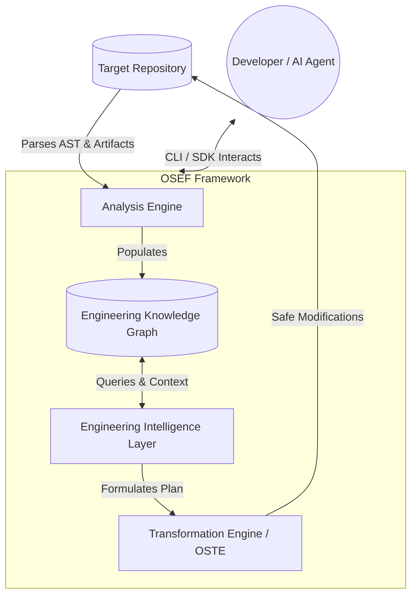

<div align="center">
  <!-- TODO: Insert Project Logo Here -->
  <!--  -->

  # OSEF: Open Source Engineering Framework
  
  **The engineering operating system for AI-assisted software development.**

  [](https://www.python.org/downloads/)
  [](https://github.com/Aryamannatrajan21/OSEF/actions)
  [](https://github.com/Aryamannatrajan21/OSEF/actions)
  [](https://opensource.org/licenses/Apache-2.0)
  [](https://pypi.org/project/osef/)
  [](https://aryamannatrajan21.github.io/OSEF/)
  [](https://github.com/astral-sh/ruff)
  [](https://mypy-lang.org/)
  [](https://github.com/Aryamannatrajan21/OSEF/releases)

</div>

---

## 🔭 Vision

Software engineering is fundamentally about managing complexity, architecture, and constraints—not just generating code. Today's AI tools treat repositories as collections of text files. OSEF exists to shift the paradigm: **a repository should be understood before it is transformed.**

---

## 🧠 What is OSEF?

**OSEF** is not an AI code generator. It is an **AI-native engineering platform** designed to provide structure, context, and semantic understanding to automated agents and developers alike. 

At its core, OSEF features:
- **Engineering Operating System:** A foundational framework that enforces architectural boundaries and principles.
- **Engineering Knowledge Graph (EKG):** An intelligent, graph-based representation of your repository that models dependencies, contracts, and architecture.
- **Repository Intelligence:** Semantic parsing that uncovers the hidden design decisions, constraints, and intent embedded within the project.
- **Transformation Engine (OSTE):** A robust engine that executes safe, verified code modifications based on the intelligence gathered.
- **Plugin SDK:** A highly extensible architecture allowing custom intelligence and transformation modules.

---

## ⚡ Why OSEF?

| The "Code Generation" Workflow | The OSEF Engineering Workflow |
| :--- | :--- |
| **Starts with source code** | **Starts with the engineering system** |
| Treats files as isolated text | Understands cross-file architectural constraints |
| Generates code based on patterns | Solves problems based on intent and contracts |
| Leads to tech debt and fragmentation | Preserves maintainability and design principles |

OSEF is built for Senior Engineers, Platform Architects, and Open Source Maintainers who demand reliability, extensibility, and rigorous engineering standards from AI tools.

---

## 📜 Core Principles

Everything built within OSEF adheres to the **OSEF Constitution** and its strict engineering heuristics. Our core philosophies include:

1. **Engineering Before Implementation:** Think, design, and plan before writing a single line of code.
2. **Context Over Output:** Quality transformations require absolute understanding of the repository’s state and history.
3. **Immutability & Safety:** Changes must be deterministic, reversible, and explicitly authorized.
4. **Extensibility by Design:** OSEF is built as a microkernel-style plugin architecture.

> Read the full [Engineering Principles](https://aryamannatrajan21.github.io/OSEF/engineering_principles/) in our documentation.

---

## 🏗️ Architecture Overview



---

## 🚀 Installation

You can install OSEF globally or within your project environment. We recommend using `uv` for modern, fast dependency management, but standard `pip` works perfectly.

### Using `pip`
```bash
pip install osef
```

### Using `uv`
```bash
uv pip install osef
```

<details>
<summary><strong>Development Setup</strong></summary>

To contribute to OSEF or run it locally from source:

```bash
# Clone the repository
git clone https://github.com/Aryamannatrajan21/OSEF.git
cd OSEF

# Install in editable mode with dev dependencies
pip install -e ".[dev,docs]"

# Run tests to verify
pytest
```
</details>

**Requirements:** Python 3.12+

---

## ⏱️ Quick Start

Get OSEF running in your repository in under 5 minutes:

1. **Initialize the Project**
   ```bash
   osef init
   ```
   *Creates the `.osef/` configuration folder and sets up your environment.*

2. **Generate the Knowledge Graph**
   ```bash
   osef graph build
   ```
   *Parses your codebase and populates the Engineering Knowledge Graph.*

3. **Audit the Architecture**
   ```bash
   osef validate
   ```
   *Checks your repository against its defined architectural constraints.*

---

## 💻 CLI Examples

OSEF provides a powerful command-line interface for direct interaction.

```bash
# Initialize a new OSEF project context
osef init

# Run a diagnostic health check on your environment
osef doctor

# Build and visualize the Engineering Knowledge Graph
osef graph build
osef graph view --format json

# Validate current code against architectural contracts
osef validate --strict
```

---

## 📁 Repository Structure

```text
OSEF/
├── .github/          # Enterprise governance, issue templates, workflows
├── docs/             # MkDocs material documentation
├── governance/       # Constitution, Engineering Principles, ADRs, RFCs
├── implementation/   # Backlogs, active sprint plans, and tracking
├── scripts/          # Automation and development utility scripts
├── src/
│   └── osef/         # Core framework source code
└── tests/            # Pytest suite
```

---

## 📚 Documentation

Our documentation is the source of truth for all architectural decisions and API designs.

- [Documentation Site](https://aryamannatrajan21.github.io/OSEF/)
- [The Manifesto](https://aryamannatrajan21.github.io/OSEF/manifesto/)
- [The Constitution](https://aryamannatrajan21.github.io/OSEF/constitution/)
- [Architecture Decision Records (ADRs)](https://aryamannatrajan21.github.io/OSEF/adrs/)
- [Request For Comments (RFCs)](https://aryamannatrajan21.github.io/OSEF/rfcs/)

---

## 📊 Current Status

OSEF is currently under active development.

- **Current Milestone:** `v0.2.0-alpha` (Engineering Foundation Released)
- **Completed:** Repository intelligence, foundational CLI, strict enterprise governance.
- **Current Sprint (Sprint 2):** Open Source Transformation Engine (OSTE) development.
- **Next Up:** Plugin SDK stabilization and AST parsers.

---

## 🤝 Contributing

We welcome contributions from developers, researchers, and maintainers who share our vision for an engineering-first AI ecosystem.

1. Read our [CONTRIBUTING.md](CONTRIBUTING.md).
2. Familiarize yourself with the [Engineering Principles](governance/ENGINEERING_PRINCIPLES.md).
3. Pick up a `triage` or `help wanted` issue.
4. Open a Pull Request!

---

## 🏛️ Governance

OSEF is governed by a rigorous maintainer model designed for enterprise scalability.

- **Direct pushes to `main` are strictly forbidden.**
- All architectural changes must pass through the **RFC Process**.
- Decisions are documented immutably via **ADRs**.
- Code reviews strictly enforce the **OSEF Constitution**.

> For security reports, please refer to our [SECURITY.md](SECURITY.md). For support, use [GitHub Discussions](https://github.com/Aryamannatrajan21/OSEF/discussions).

---

## 📄 License

This project is licensed under the **Apache License 2.0**. See the [LICENSE](LICENSE) file for more details.

---

<div align="center">
  <p><strong>OSEF: Understand before you transform.</strong></p>
  <p>
    <a href="https://github.com/Aryamannatrajan21/OSEF/discussions">Discussions</a> •
    <a href="https://github.com/Aryamannatrajan21/OSEF/issues">Issues</a> •
    <a href="https://aryamannatrajan21.github.io/OSEF/">Documentation</a>
  </p>
</div>
