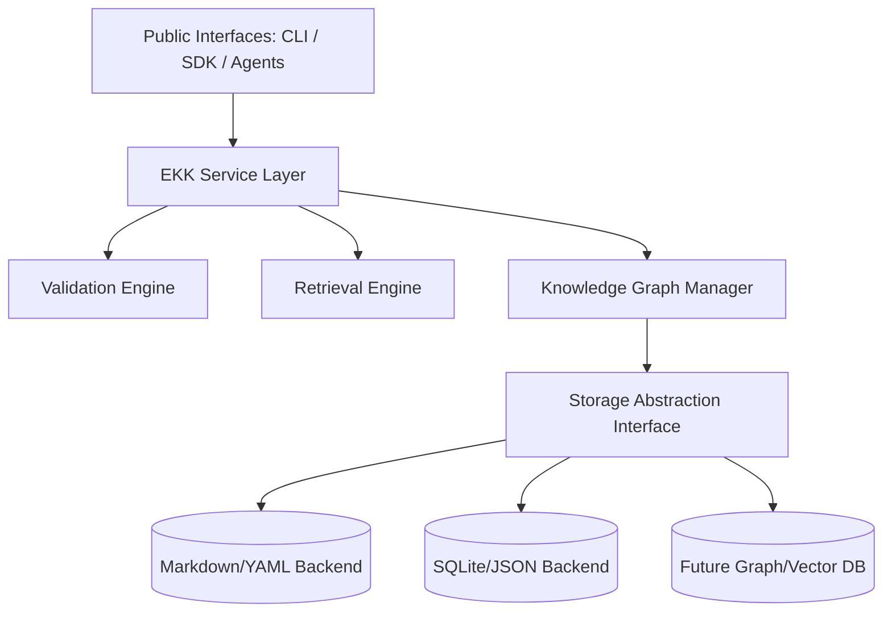
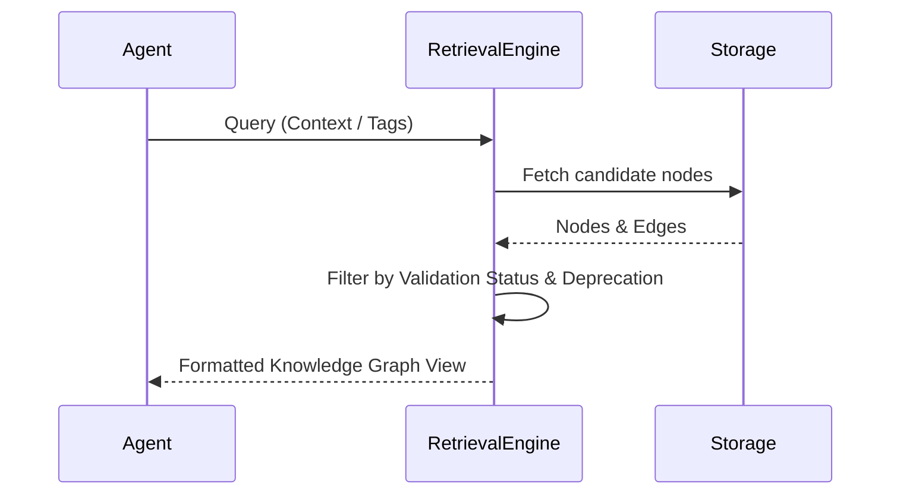

# OSEF Engineering Knowledge Kernel (EKK) Master Architecture

## 1. Executive Summary
The Engineering Knowledge Kernel (EKK) is the foundational subsystem of the Open Source Engineering Framework (OSEF). It serves as the authoritative, AI-agnostic, versioned knowledge base for all engineering principles. It is the repository of truth for all AI agents, plugins, and automation tools, enforcing the philosophy that "knowledge is permanent, prompts are temporary."

## 2. Domain Model
Engineering knowledge is categorized into distinct domains to ensure organization and extensibility.

### Core Domains:
- **Principles:** High-level engineering philosophies (e.g., Constitution).
- **Architecture:** System designs, ADRs, RFCs.
- **Standards:** Coding, Security, Testing, Accessibility, API Design.
- **Practices:** Design Patterns, Methodologies (e.g., CI/CD, DevOps).
- **Technology:** Language-specific knowledge (Python, JS, Rust), Frameworks.
- **Operations:** Playbooks, Migration Guides, Checklists.

Each domain operates independently but is highly interlinked through the Knowledge Graph.

## 3. Component Diagram


## 4. Sequence Diagrams
### Knowledge Retrieval Flow


## 5. Data Flow
1. **Ingestion:** Knowledge is ingested via SDK or parsed from files.
2. **Validation:** The Validation Engine ensures Constitution compliance, schema adherence, and required metadata.
3. **Graph Integration:** Edges are constructed based on dependencies.
4. **Retrieval:** External systems query the EKK, which returns validated, context-aware engineering knowledge.

## 6. Public Interfaces
The EKK exposes strict, stable boundaries:
- `QueryAPI`: Semantic, Tag, and ID-based retrieval.
- `GraphAPI`: Methods to traverse relationships (`get_dependencies`, `get_superseded_by`).
- `MutationAPI`: Versioned updates to knowledge nodes.
- `ValidationAPI`: Exposes the validation checks to plugins and reviewers.

## 7. Python Package Design
The EKK will be structured as `osef.ekk` within the main PyPI package.
```
osef/
  ekk/
    __init__.py
    models.py       # Pydantic models for Knowledge Node/Edge
    graph.py        # In-memory graph operations
    retrieval.py    # Search and traversal logic
    validation.py   # Rule checking against Constitution
    storage/
      base.py       # Storage abstraction interface
      markdown.py   # Markdown + YAML frontmatter implementation
      sqlite.py     # Relational implementation
```

## 8. Directory Structure
The knowledge artifacts themselves reside in `knowledge/` and `architectures/`, while the EKK Python source resides in `osef/ekk/`.

## 9. SDK Specification
```python
from osef.ekk import EKK, KnowledgeQuery

# Initialize kernel with default markdown storage
kernel = EKK(storage="markdown", path="./knowledge")

# Semantic retrieval
results = kernel.search(KnowledgeQuery(tags=["python", "security"], context="Implementing auth"))

# Graph traversal
node = kernel.get_node("ADR-0001")
dependencies = node.get_dependencies()
```

## 10. CLI Integration
The EKK is exposed via the Typer CLI:
- `osef ekk search --tags security,python`
- `osef ekk validate --node ADR-0005`
- `osef ekk graph --visualize`

## 11. Plugin Integration
Plugins can register new Knowledge Domains or custom Storage Adapters through the `osef.ekk.plugins` extension point.

## 12. Agent Integration
AI Agents never store engineering rules internally. They query the EKK upon initialization to load the relevant context (e.g., "Load all Python typing rules").

## 13. Prompt Engine Integration
The Prompt Engine constructs dynamic system prompts by injecting EKK retrieval results as structured markdown, ensuring the LLM is always guided by the latest ADRs and Constitution rules.

## 14. Validation Engine Integration
The EKK provides the source of truth for the Validation Engine. If code is generated, the Validation Engine queries the EKK for the relevant standards and asserts compliance.

## 15. Testing Strategy
- **Unit Tests:** Validate graph traversal, semantic versioning logic, and Pydantic schema constraints.
- **Integration Tests:** Ensure the EKK Storage adapters correctly parse the filesystem.
- **Data Integrity Tests:** CI pipelines will automatically run `osef ekk validate` against the repository to prevent orphaned nodes or broken links.

## 16. Security Model
- **Tamper Detection:** Future iterations will support SHA-256 checksums of knowledge nodes.
- **Validation Status:** Unvalidated or untrusted knowledge is flagged and isolated.

## 17. Performance Considerations
- The initial Python implementation will cache the graph in memory during runtime.
- For massive repositories, the storage abstraction allows swapping to SQLite to avoid heavy filesystem I/O on every lookup.

## 18. Scalability Strategy
The storage abstraction layer guarantees that if the EKK outgrows simple local files, it can seamlessly migrate to a dedicated Graph Database (e.g., Neo4j) or Vector Store without altering the Public Interfaces or Agent logic.

## 19. Migration Strategy
Legacy markdown documents will be ingested via a CLI parsing tool (`osef ekk import`) that extracts existing context and auto-generates the required YAML metadata schema (ID, Version, Tags).

## 20. Future Roadmap
- **v1.0:** Markdown/YAML backend, Pydantic models, in-memory graph, CLI search.
- **v1.5:** SQLite caching for performance, advanced Semantic Similarity using local embeddings.
- **v2.0:** Cryptographic signing of architecture decisions, remote EKK synchronization.
