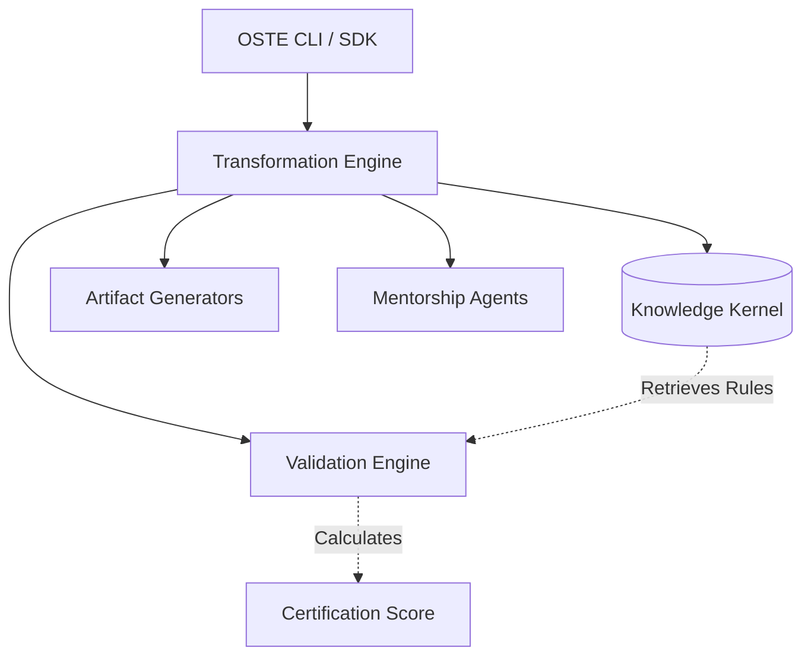

# OSEF Open Source Transformation Engine (OSTE)
## Master Architecture & Product Specification

---

## 1. Product Requirements
OSTE transforms software repositories into sustainable, production-quality open-source projects. It evaluates, mentors, and certifies repositories, ensuring they meet rigorous engineering standards. 

**Core Workflows:**
- **Repository Analysis:** Audit architecture, documentation, security, and governance to produce an Open Source Readiness Report.
- **Open Source Preparation:** Mentorship and generation of README, CONTRIBUTING, ADR systems, and community files.
- **License Recommendation:** Interactive Q&A mapping commercial goals to licensing models.
- **Governance Initialization:** Establish RFC/ADR workflows and maintainer policies.
- **Repository Certification:** Score repositories across multi-dimensional criteria (Bronze to Diamond).
- **Continuous Improvement:** Monitor repositories post-release to suggest documentation and architectural updates.

---

## 2. Architecture
OSTE sits above the Engineering Knowledge Kernel (EKK). It relies heavily on the `AgentProvider` to execute workflows and the `ValidationProvider` to score artifacts against EKK principles.


---

## 3. Domain Model
- `AuditReport`: Represents the result of a Repository Analysis workflow.
- `HealthMetric`: An individual measurable criterion (e.g., "Has CI/CD Pipeline").
- `CertificationScore`: An aggregate evaluation mapped to a certification tier.
- `MentorshipSession`: The state of an interactive user dialogue.

---

## 4. Repository Health Model
A multi-dimensional model evaluating:
1. **Architecture:** Clear component boundaries, existing ADRs.
2. **Documentation:** API Docs, Developer Guides, Usage Examples.
3. **Code Quality & Testing:** Coverage, Linting.
4. **Security:** Vulnerability scanning, `SECURITY.md`, Dependency Health.
5. **Governance:** RFCs, Maintainer processes.
6. **Community:** PR Templates, Issues, `CODE_OF_CONDUCT.md`.
7. **Release Process:** Semantic versioning, Changelogs.

---

## 5. Open Source Maturity Model
- **Level 0 (Private Prototype):** No licensing, no docs.
- **Level 1 (Public Code):** Has license, basic README.
- **Level 2 (Maintained Project):** Has CI/CD, Contribution guide, Issue templates.
- **Level 3 (Growing Community):** Has Governance, Code of Conduct, active PR reviews.
- **Level 4 (Healthy OS Project):** Has ADRs, RFCs, Security Policies, multi-maintainer model.
- **Level 5 (Foundation-Level):** Cross-organizational governance, rigorous release cadence.

---

## 6. Certification Framework
- **Bronze:** Meets Level 1 (Legal to use, basic docs).
- **Silver:** Meets Level 2 (Usable and open to PRs).
- **Gold:** Meets Level 3 (Safe for production, governed).
- **Platinum:** Meets Level 4 (Enterprise-grade, transparent architecture).
- **Diamond:** Meets Level 5 (Industry standard).

*Certification outputs include actionable advice explaining exactly how to achieve the next tier.*

---

## 7. CLI Design
- `osef analyze`: Generate technical debt and readiness reports.
- `osef open-source`: Interactive initialization wizard.
- `osef certify`: Evaluate and assign a maturity score/tier.
- `osef improve`: Auto-suggest fixes for low-scoring health metrics.
- `osef license`: Interactive license recommendation tool.
- `osef governance`: Setup ADR/RFC structures.

---

## 8. SDK Design
Stable Python interfaces allowing CI/CD systems or GitHub bots to evaluate PRs or repositories dynamically.
```python
from osef.oste import Certifier, ReadinessReport

async def check_repo():
    certifier = Certifier()
    report: ReadinessReport = await certifier.evaluate_path("./repo")
    if report.tier < "Gold":
        print(report.get_improvement_plan())
```

---

## 9. Plugin Architecture
OSTE delegates language-specific checks to plugins (e.g., `osef-python` checks `pyproject.toml`, `osef-java` checks `pom.xml`). Plugins implement the `ValidationProvider` protocol to inject new `HealthMetric` checks into the overall `CertificationScore`.

---

## 10. Knowledge Integration
OSTE hardcodes zero engineering rules. To recommend a license, OSTE queries the EKK for "Licensing Strategies". To score architecture, it retrieves "Architectural Standards".

---

## 11. Engineering Evaluation Framework
Scores and evaluations are driven by a dynamic **Engineering Evaluation Framework** rather than static scoring weights or magic numbers.
- **Rule-Based Evaluation:** Evaluation rules originate from the Engineering Knowledge Kernel. The engine consumes these rules rather than embedding them.
- **Repository Profiles:** Different project types (e.g., Library, Framework, CLI, Desktop, Mobile, SaaS, Enterprise, Research, Plugin) expose different evaluation rules. A SaaS project has different security and governance requirements than a CLI utility.
- **Knowledge-Driven Policies:** Evaluation acts as an evolving engineering standard mapped to the current state of the EKK.
- **Extensibility:** Plugins can inject custom rules into the evaluation pipeline without altering the core scoring logic.

---

## 12. Governance Framework
OSTE provisions projects with a dual-layer governance model:
1. **Decision Making:** Templates and workflows for RFCs and ADRs.
2. **Community Management:** Roles (Maintainer, Triager, Contributor) and promotion pathways.

---

## 13. Documentation Standards
Enforces "Documentation First" by checking for the existence and synchronicity of PRDs, System Designs, and API Docs before granting Silver or Gold certifications.

---

## 14. Testing Strategy
- **Core Tests:** Verify the scoring algorithm correctly penalizes known bad repository mocks.
- **Integration Tests:** Ensure language plugins accurately parse external repositories.

---

## 15. Security Considerations
- OSTE never executes untrusted code during analysis.
- Secrets scanning is prioritized during `osef analyze`.
- Supply chain security checks (Dependency Health) severely impact the Certification Score.

---

## 16. Extensibility Strategy
Using the Event Bus, third-party tools can listen to `CertificationCompleted` events to trigger deployments, post GitHub comments, or update internal dashboards.

---

## 17. Performance Considerations
Repository analysis can be I/O heavy. OSTE will utilize Python's `asyncio` for concurrent file parsing and dependency resolution to ensure `osef audit` runs in seconds.

---

## 18. Migration Strategy
Projects adopting OSEF post-creation can use `osef open-source --adopt`. OSTE will parse existing histories, recommend bridging ADRs for legacy decisions, and map existing contribution guidelines to OSEF standards.

---

## 19. Future Roadmap
- **v1.0:** Core CLI, Python/JS plugins, Bronze/Silver certification.
- **v2.0:** GitHub App integration for continuous PR certification.
- **v3.0:** Global OSEF Leaderboard tracking the health of the open-source ecosystem.
