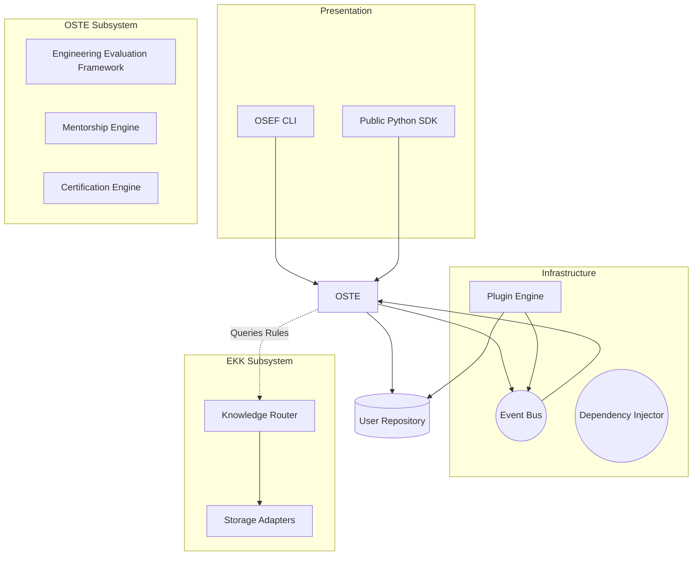

# OSEF System Design

## 1. Overview
The OSEF platform is composed of distinct, decoupled subsystems communicating via a central Event Bus. This System Design outlines the highest-level architecture of the framework, mapping the requirements from the SRS into structural components.

## 2. High-Level Architecture

### 2.1. The Engineering Knowledge Kernel (EKK)
The bottom-most foundational layer. It translates persistent storage (Markdown, YAML, GraphDB) into structured domain models (`KnowledgeItem`). It provides a read-only query interface for the rest of the system.

### 2.2. The Open Source Transformation Engine (OSTE)
The behavioral core. It acts as the orchestration layer that applies rules from the EKK against a target repository. It contains the logic for the Engineering Evaluation Framework, maintaining the state of a certification audit or mentorship session.

### 2.3. The Event Bus
The asynchronous messaging spine of the application. It ensures that when OSTE finishes analyzing a repository (`RepositoryAnalyzed`), the Plugin Engine can trigger language-specific linting without OSTE needing to know about the plugins directly.

### 2.4. The Plugin Engine
The extensibility bridge. It discovers, loads, and securely sandbox-wraps third-party capabilities, injecting them into the Event Bus and Dependency Injector.

### 2.5. The Presentation Layer (CLI & SDK)
The outermost boundary. 
- The **CLI (`Typer`)** maps terminal input into OSTE workflows and presents rich Markdown output.
- The **Public SDK** provides a typed, protocol-driven API for external Python scripts and bots.

---

## 3. Platform Component Diagram

## 4. Subsystem Isolation Principles
1. **OSTE knows nothing of Storage:** OSTE requests an architectural rule. It does not know if that rule came from SQLite or a YAML file. That is the EKK's responsibility.
2. **The EKK knows nothing of Repositories:** The EKK simply serves data. It does not analyze code or assign scores. That is OSTE's responsibility.
3. **The CLI knows nothing of Algorithms:** The CLI calls `oste.certify(path)`. The logic inside `certify` is fully encapsulated. 

This strict separation guarantees that OSEF can evolve from a local Python CLI into a distributed GitHub App without rewriting the core business logic.
