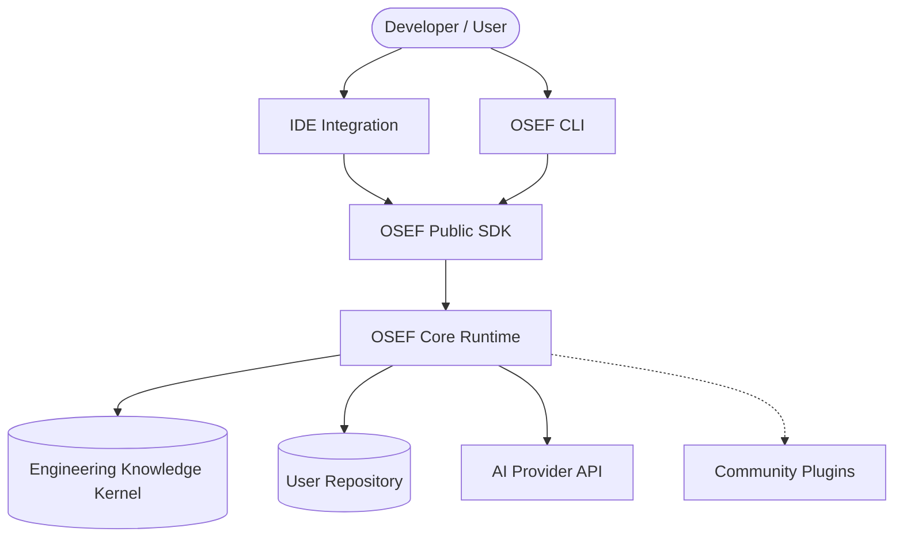
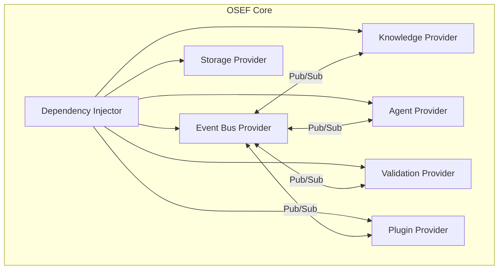
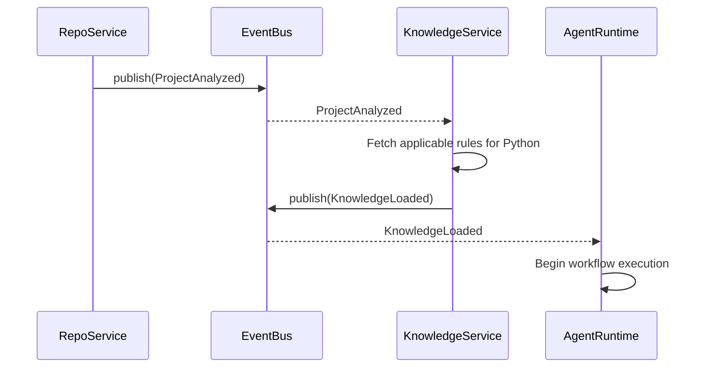
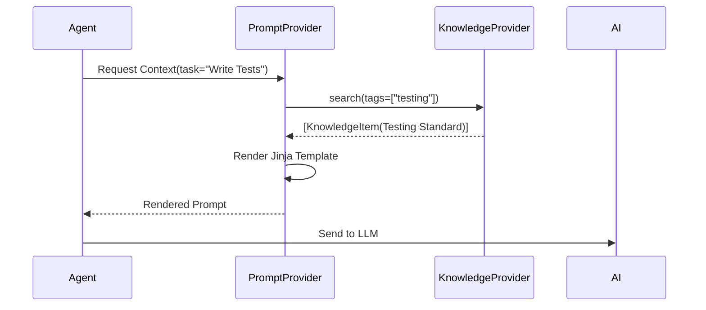
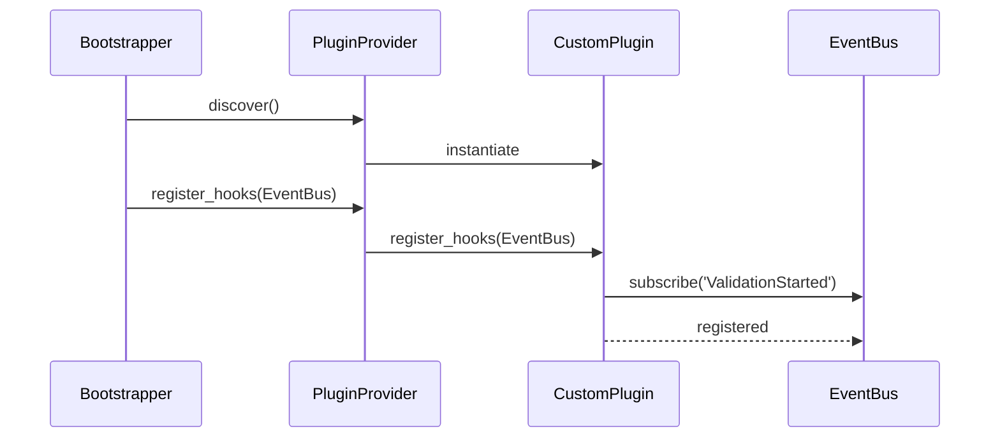
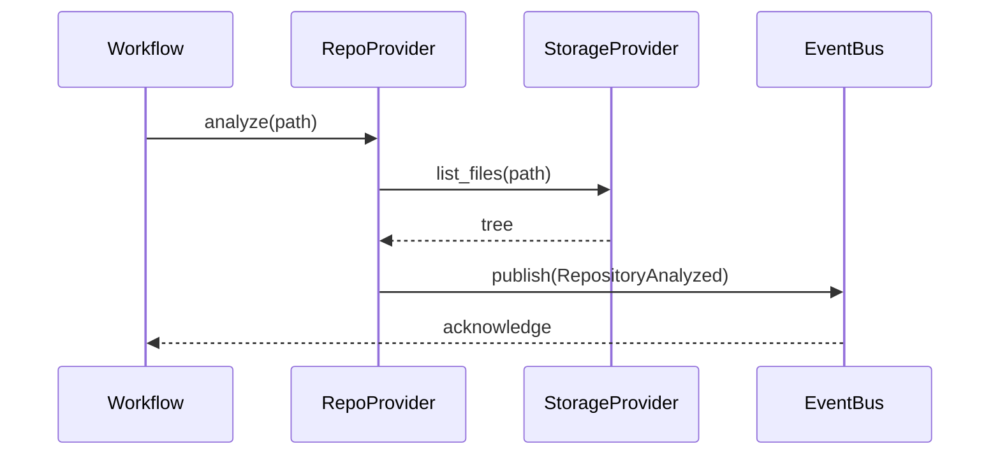

# OSEF System Interaction Models

## Overview
This document visualizes the runtime interactions of OSEF using Mermaid.js diagrams. It maps how the components defined in the Service Contracts and Domain Models interact to fulfill Workflows and Events.

---

## 1. Context Diagram
*How OSEF fits into the broader ecosystem.*

---

## 2. Component Diagram
*The internal architecture of the OSEF Core.*

---

## 3. Event Flow
*Demonstrating the decoupled, event-driven architecture.*

---

## 4. Knowledge Retrieval Flow
*How the EKK serves the Agent Runtime.*

---

## 5. Plugin Registration Flow
*How extensions integrate securely.*

---

## 6. Repository Analysis Flow
*How OSEF discovers the state of a user's code.*

