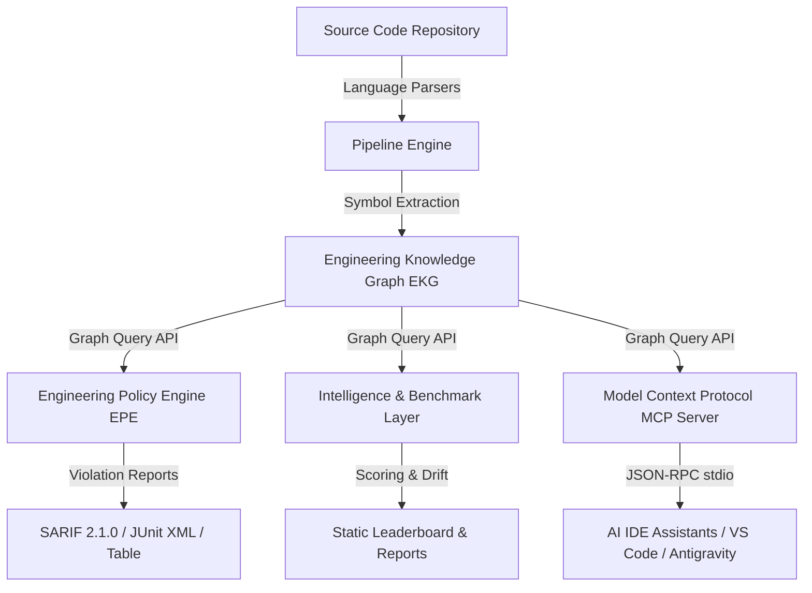

# OSEF Architecture Overview

OSEF is structured as a layered, modular framework designed to separate source code parsing, graph graph construction, policy evaluation, and external tool integration.

---

## High-Level Architecture Diagram

---

## Architectural Pillars

### 1. Core Engine & Graph Construction
The `PipelineEngine` (`src/osef/core/pipeline.py`) orchestrates project discovery and invokes language-specific parser plugins. Every source artifact is converted into standardized **Symbol Tables** and compiled into a directed **Engineering Knowledge Graph (EKG)**.

* **[Graph Schema Specification](architecture/GRAPH_SCHEMA.md)**
* **[Semantic Model](architecture/SEMANTIC_MODEL.md)**
* **[Symbol Table Specification](architecture/SYMBOL_TABLE_SPEC.md)**
* **[Call Graph Specification](architecture/CALL_GRAPH_SPEC.md)**

### 2. Declarative Engineering Policy Engine (EPE)
The EPE (`src/osef/epe/`) evaluates constitutional architecture policies against EKG symbol facts. Rules are written in declarative syntax to enforce architectural invariants without relying on brittle regex matching.

* **[Policy Engine Architecture](architecture/POLICY_ENGINE_ARCHITECTURE.md)**
* **[Policy Specification](architecture/POLICY_SPECIFICATION.md)**
* **[Rule Writing Guide](architecture/RULE_WRITING_GUIDE.md)**
* **[EPE API](architecture/EPE_API.md)**

### 3. Intelligence & Benchmarking
The Intelligence Layer (`src/osef/intelligence/`) quantifies technical debt, architecture drift, and dependency health, generating objective benchmark scores for engineering confidence.

* **[Engineering Intelligence Specification](architecture/ENGINEERING_INTELLIGENCE_SPEC.md)**
* **[Benchmarking Guide](architecture/BENCHMARKING_GUIDE.md)**

### 4. Plugin Ecosystem & Security Sandbox
OSEF supports third-party language extractors and custom analyzers packaged as cryptographically signed archives (`plugin.yaml`). Plugins execute within controlled sandboxes.

* **[Plugin API Specification](architecture/PLUGIN_API.md)**
* **[Plugin Manifest Specification](architecture/PLUGIN_MANIFEST_SPEC.md)**
* **[Plugin Security Model](architecture/PLUGIN_SECURITY_MODEL.md)**
* **[Marketplace Protocol](architecture/MARKETPLACE_PROTOCOL.md)**

### 5. Universal Distribution & IDE Integration
OSEF integrates into standard developer workflows via Docker OCI containers, VS Code VSIX extensions, GitHub Actions (`action.yml`), and standard Model Context Protocol (`stdio`) servers.

* **[Extension Host Specification](architecture/EXTENSION_HOST_SPEC.md)**
* **[CLI Extension Specification](architecture/CLI_EXTENSION_SPEC.md)**
* **[SDK Versioning Specification](architecture/SDK_VERSIONING_SPEC.md)**