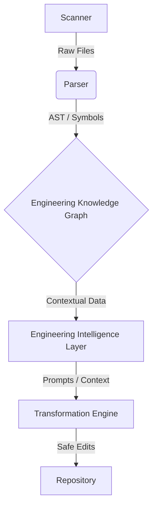

# Architecture Guide

OSEF is built around the philosophy that code is data. To transform a repository safely, we must model its internal relationships.

## The Core Subsystems

### 1. Scanner & Parser
The Scanner indexes the repository, identifying languages and structures. The Parser extracts Abstract Syntax Trees (ASTs) and symbols (functions, classes, variables).

### 2. Engineering Knowledge Graph (EKG)
The EKG is the heart of OSEF. It connects symbols to their usages, files to their dependencies, and code to its documentation.

### 3. Engineering Intelligence Layer (EIL)
This layer translates graph queries into LLM-friendly context. Instead of giving an AI a massive string of code, the EIL gives it exactly the dependencies it needs to understand a function.

### 4. Transformation Engine (OSTE)
The engine that executes changes safely. It validates that an AI's proposed code edits do not break existing contracts defined in the EKG.

### 5. Plugin SDK
OSEF is extensible. The Plugin SDK allows you to write custom parsers for new languages, new validation rules for the Transformation Engine, or custom heuristics for the EKG.

---
*Last Updated: v1.0.0-LTS | Related Architecture: [REFERENCE_ARCHITECTURE.md](../architectures/REFERENCE_ARCHITECTURE.md)*
