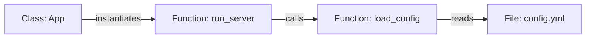

# Repository Intelligence

Repository Intelligence is how OSEF turns dead text into a live graph.

## The Scanner
The Scanner walks the repository directory, ignoring files defined in `.gitignore` and `.osefignore`. It identifies the file types and dispatches them to the appropriate Parsers.

## The Parser
The Parser reads the file (using Python's `ast` module for Python files, or tree-sitter for others) and extracts classes, functions, variables, and imports.

## The Engineering Knowledge Graph (EKG)
The EKG stores these extractions as Nodes, and the imports/calls as Edges.

## Transformation Planning
Before the Transformation Engine applies an LLM's suggested code patch, the EIL checks the EKG:
- *If the LLM deletes `load_config`, does anything else call it?*
- If yes, the Transformation is rejected and the LLM is prompted to fix the error.

---
*Last Updated: v1.0.0-LTS | Related Docs: [IMPLEMENTATION_STATUS.md](../IMPLEMENTATION_STATUS.md)*
